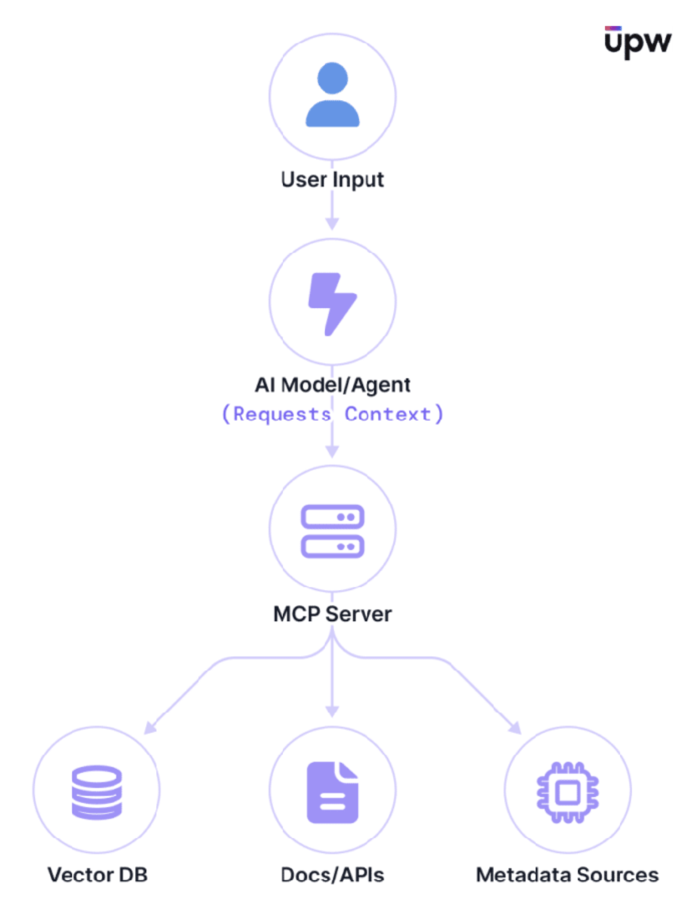
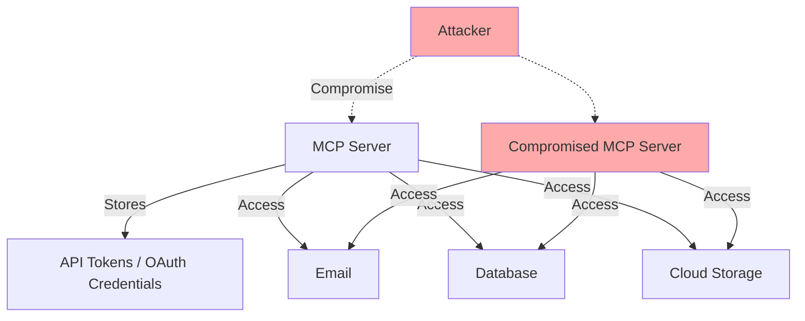
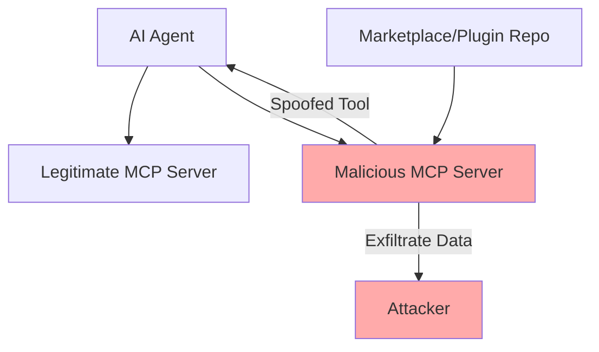
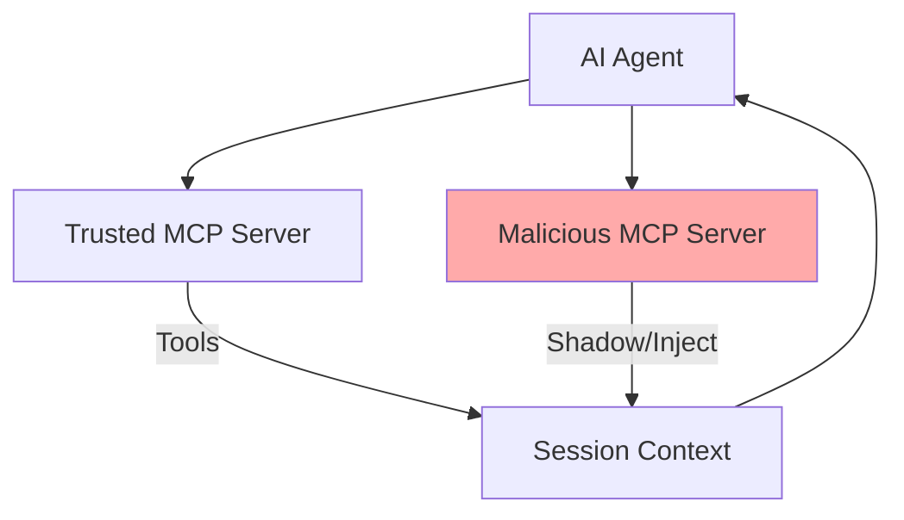
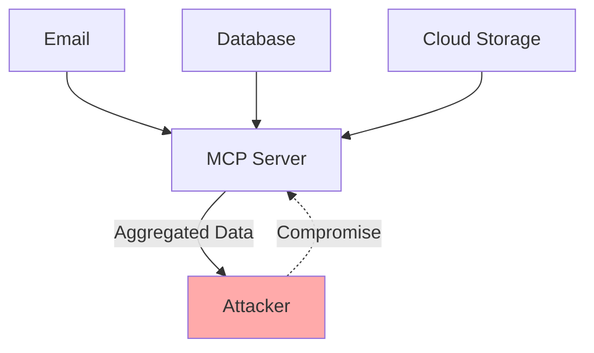
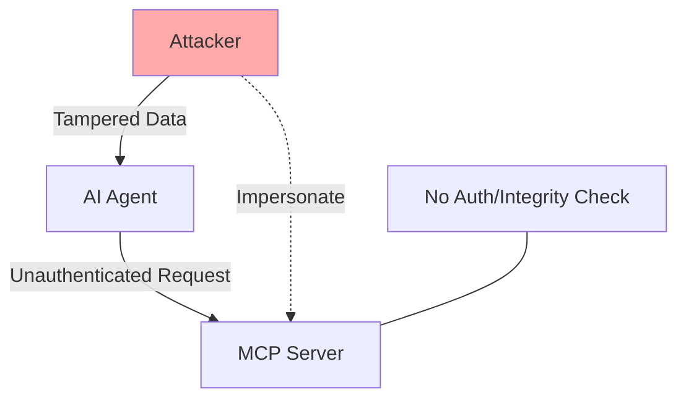

# Model Context Protocol (MCP): Integrating AI with Tools – Benefits and Security Risks

## Introduction

The Model Context Protocol (MCP) is a new open standard that bridges AI models with external tools and data sources. Introduced by Anthropic in late 2024, MCP has quickly gained traction as a way to connect AI assistants (like ChatGPT or Claude) to things like email, databases, files, and other services. Major companies are adopting MCP (even OpenAI announced support in 2025), because it promises to supercharge what AI systems can do by giving them live access to information and actions beyond their trained knowledge. 

This article explores how MCP works and its benefits, while also highlighting critical vulnerabilities and cybersecurity risks that come with this powerful new capability. Even as MCP unlocks amazing possibilities, it’s essential to apply time-tested security principles and remain mindful of the risks introduced into our environments and workflows.

## What is MCP and How Does It Work?

At its core, MCP defines a standardized way for AI models (clients) to interact with external context providers (servers). The MCP server acts as a middleman: the AI can request data or actions, and the server fetches or executes them on connected resources. This follows a simple client–server architecture (using JSON-RPC 2.0 under the hood) to pass messages between the AI system and external data sources.

In essence, MCP is like a universal adapter that lets an AI agent say, “Here’s the user’s query, now get me what I need to answer it”, and the MCP server will retrieve the relevant info or perform the task on behalf of the AI.

MCP follows a client–server model: the AI agent (client) requests additional context from an MCP server, which in turn fetches data from various sources (e.g. vector databases, documents/APIs, internal tools) and returns it to the AI.

A typical MCP deployment might look like this: an AI Assistant (client) connects to an MCP server, which is configured with “tools” or connectors to your systems (for example, a database query function, an email-sending function, a file search function, etc.). When the user asks something that requires external information or action, the AI can call those tools via MCP and get results back in real time. For instance, an AI support chatbot could use MCP to query a customer database or fetch documentation on the fly. This standardized context interface saves developers from writing custom integration code for each AI project. MCP essentially turns context into infrastructure, allowing AI models to have a dynamic “memory” or access layer to the live data they need.



## Benefits of the Model Context Protocol

MCP’s popularity is driven by significant benefits it brings to AI applications:

- **Interoperability and Standardization:** MCP provides a unified, standard way to connect AI systems with a wide array of external services. This eliminates a lot of one-off integration work, since developers can plug into the MCP standard instead of custom-building for each data source. The “universal adapter” nature of MCP means it works across cloud apps, databases, file systems, and more, much like a USB-C for AI integrations. The fundamental benefit is simplified integration across diverse systems, replacing ad-hoc solutions with a common protocol.
- **Faster Scaling of AI Projects:** By using a unified connection model, organizations can scale up AI-powered solutions more easily. It’s straightforward to add new data sources or tools to an AI’s repertoire via MCP without redesigning the whole pipeline. This standard approach accelerates development and deployment of AI features across multiple departments or data silos. In short, MCP helps enterprises roll out AI capabilities faster and extend AI access to more data sources with less effort.
- **Enhanced Context and Better Answers:** MCP dramatically improves the quality and relevance of AI responses by giving models access to fresh and relevant context at inference time. Rather than being limited to their training data, AI assistants can fetch up-to-date information (like the latest knowledge base articles, real-time account data, or recent emails) to answer user queries. This enriched contextual understanding means the AI can produce more accurate, useful, and context-aware outputs. Users get the benefit of powerful large language models combined with real-time, personalized data.
- **Complex, Agentic Workflows:** MCP isn’t limited to simple question-answer retrievals; it enables more interactive and multi-step workflows. The protocol supports bidirectional communication – an MCP server can pause and ask the AI for guidance mid-operation (“sampling”), allowing the AI to adjust its approach based on interim results. This means AI “agents” can carry out elaborate tasks: for example, an AI agent can plan a task, call a tool, get partial results, then refine its next step by asking the AI again, all within the MCP session. Such agentic capabilities allow for sophisticated automation that adapts in real time, far beyond a static one-off API call. In summary, MCP opens the door to more flexible and powerful AI behaviors that can engage in a dialogue with tools and data sources.

These benefits illustrate why MCP is generating so much excitement. It provides a standardized bridge between AI and the rich context of the real world, unlocking new levels of functionality. However, with great power comes great responsibility – and in this case, significant new attack surfaces and security considerations.

## Types of MCP Transport and Their Security Considerations

MCP can be implemented over several different transport mechanisms, each with its own operational and security characteristics. The most common types are:

### 1. HTTP (Hypertext Transfer Protocol)
- **Description:** The MCP server exposes an HTTP endpoint (often using JSON-RPC 2.0 over HTTP/S). Clients (AI models or agents) send requests and receive responses over standard web protocols.
- **Security Considerations:**
  - **Encryption:** Always use HTTPS to protect data in transit from eavesdropping and man-in-the-middle attacks.
  - **Authentication:** HTTP endpoints should require strong authentication (API keys, OAuth, or mutual TLS) to prevent unauthorised access.
  - **Exposure:** Publicly exposed HTTP endpoints are more susceptible to automated attacks, scanning, and exploitation. Restrict access to trusted networks where possible.
  - **Replay/Injection:** HTTP is stateless by default, so be wary of replay attacks and ensure proper validation of all incoming requests.

### 2. SSE (Server-Sent Events)
- **Description:** SSE is a unidirectional protocol where the server pushes events to the client over a long-lived HTTP connection. MCP can use SSE to stream context or tool results to the AI client in real time.
- **Security Considerations:**
  - **Encryption:** As with HTTP, always use HTTPS for SSE streams.
  - **Authentication:** Ensure the initial connection is authenticated and that tokens are not leaked in URLs or headers.
  - **Session Management:** Long-lived connections can be hijacked if not properly secured. Monitor for dropped or reconnected sessions and validate client identity throughout.
  - **Data Leakage:** Since SSE is push-based, be careful not to send sensitive data to unauthorised clients if session state is lost or mismanaged.

### 3. stdio (Standard Input/Output)
- **Description:** MCP can be run as a local process, with the AI client and MCP server communicating via standard input/output streams (e.g., pipes or subprocesses). This is common for local or embedded deployments.
- **Security Considerations:**
  - **Isolation:** stdio-based MCP is typically only as secure as the local environment. If an attacker can run code on the same machine, they may be able to intercept or inject data into the stdio stream.
  - **Process Permissions:** Ensure the MCP process runs with minimal privileges and cannot access more of the system than necessary.
  - **No Network Exposure:** stdio-based setups are not directly exposed to the network, reducing remote attack surface, but increasing the importance of local system security.
  - **Auditability:** Logging and monitoring may be more difficult with stdio, so ensure you have sufficient audit trails for sensitive operations.

---

**Summary Table:**

| Transport | Typical Use Case         | Main Security Risks                        |
|-----------|-------------------------|--------------------------------------------|
| HTTP      | Cloud, web, remote      | Network attacks, auth bypass, replay       |
| SSE       | Streaming, real-time    | Session hijack, data leakage, auth         |
| stdio     | Local, embedded, CLI    | Local privilege escalation, interception   |

Each transport type requires a tailored security approach. Always apply the principle of least privilege, encrypt data in transit, and authenticate all endpoints—regardless of the underlying protocol.

## Security Vulnerabilities and Risks

While MCP is amazing, it also introduces new vulnerabilities that both developers and cybersecurity professionals must be aware of. By allowing AI-driven automation across many systems, MCP can inadvertently create pathways for exploits if not implemented securely. Many of the risks relate to age-old security issues (input validation, authentication, least privilege) now manifesting in this new AI-tool context layer. Below are some of the key vulnerabilities and risks associated with MCP, along with examples of how attackers could exploit them:

### Command Injection in Tools

**Diagram: How command injection can occur in an MCP tool**

```mermaid
flowchart TD
  User[User/AI Input] --> Tool[MCP Tool]
  Attacker[Attacker] -.->|Malicious Input| Tool
  Tool -->|Safe Input| Shell[Shell Command]
  Tool -->|Malicious Input| Exploit[Shell Command (Injected)]
  Shell --> System[System (Expected)]
  Exploit --> Compromise[System Compromised]
  style Compromise fill:#faa
  style Attacker fill:#faa
```

Just like any software, the functions (tools) exposed via MCP can have vulnerabilities. Unfortunately, many early MCP tools have basic security flaws like command injection. For example, a naive image conversion tool might call a system command without sanitizing input. An attacker (or even a malicious user prompt) could include shell meta-characters in a filename, e.g. `; cat /etc/passwd > leaked.txt`, to execute unauthorized commands. In one case, a tool that simply wraps an OS command was exploitable by crafting the input, leading to leakage of system files. This kind of mistake is well-understood in traditional app security, yet it can reappear in MCP implementations if developers aren’t careful.

**AI-generated input is especially unpredictable:** Even if the AI is acting on behalf of a trusted user, its output can be manipulated or unexpected. Never assume that input from the AI is safe—always validate and sanitise it as you would any external user input.

**Prefer safe APIs over shell commands:** Where possible, use language or library features that avoid shell invocation entirely. For example, use Python’s `subprocess.run` with argument lists (not shell=True), or better yet, use native image processing libraries instead of calling out to system tools. This reduces the risk of injection vulnerabilities.

**Automated security testing:** Employ static analysis tools and fuzzing to test your MCP tool code for injection vulnerabilities. Automated tools can catch many common mistakes before they reach production.

**Beware of chained attacks:** Prompt injection can be used to craft malicious input that then triggers command injection in a tool. Always consider how different vulnerabilities might be combined by an attacker.

**Real-world examples:**

- LRQA Cyber Labs demonstrated command injection in AI agent tools by passing unsanitised input to Python’s `eval()` and to shell commands via ImageMagick’s Convert tool. As they describe:

  > “There is a quite obvious command injection vulnerability within it. ... Although not directly visible in the agent’s output, the command execution was successful, and the `/tmp/test` file was created.”  
  — [LRQA Cyber Labs, 2024](https://www.lrqa.com/en/cyber-labs/vulnerabilities-in-ai-agents/)

- NetSPI security researchers showed how prompt injection in a generative AI chatbot can lead to remote code execution (RCE) on the hosting server:

  > “By submitting carefully crafted prompts, we can achieve remote code execution (RCE) on the server hosting the chatbot. This allows us to perform unauthorized actions and access sensitive resources, highlighting a significant security vulnerability in the AI system’s implementation.”  
  — [NetSPI, 2024](https://www.netspi.com/blog/technical-blog/ai-ml-pentesting/how-to-exploit-a-generative-ai-chatbot-using-prompt-injection/)

**Lesson:** All tool implementations must validate and sanitize inputs, use safe coding practices, and avoid constructing commands directly from user-provided strings – even though the “user” in this case might be an AI, the AI is acting on behalf of a real user request (possibly manipulated by an attacker). In 2025, we really shouldn’t be seeing these classic injection flaws resurface!

### Credential Theft and “Keys to the Kingdom”

**Diagram: How compromising an MCP server can expose all connected credentials**



An MCP server often needs to store API credentials or OAuth tokens to access external services (email, cloud drives, databases, etc.). This turns the MCP server into a high-value target – if an attacker compromises it, they potentially gain all those tokens and with them, access to everything the AI can reach. In other words, one breach of the MCP server can yield a trove of credentials and broad account access.

For example, if an MCP server holds a Gmail OAuth token, an attacker who steals that token could impersonate the user’s email account via their own malicious MCP instance, reading email, sending messages as the user, deleting or exfiltrating data, etc., without ever logging in through normal channels. Such token abuse might even fly under the radar because it appears as legitimate API usage rather than a suspicious login. Moreover, MCP servers often keep tokens for multiple services simultaneously (email, calendar, CRM, cloud storage), amplifying the impact of a single compromise. It’s a “keys to the kingdom” scenario – breach one component and gain access to a wide range of sensitive resources.

**Real-world examples:**

- In a 2024 case study, an AI agent with Gmail OAuth access was shown to be vulnerable to prompt injection, allowing an attacker to exfiltrate sensitive emails and delete evidence, all using legitimate OAuth tokens. As described:

  > “The agent processes this as legitimate instructions and: Summarizes recent emails (legitimate), searches for sensitive content (malicious), forwards to external address (data theft), deletes evidence (covers tracks) — all using authorized OAuth tokens. All appearing as normal API calls in logs.”  
  — [Hacker News, 2024](https://news.ycombinator.com/item?id=44205881)

- Sysdig researchers observed attacks where stolen cloud credentials were used to access and abuse cloud-hosted LLM services, resulting in financial loss, data exfiltration, and business disruption:

  > “The Sysdig Threat Research Team (TRT) recently observed a new attack that leveraged stolen cloud credentials in order to target ten cloud-hosted large language model (LLM) services, known as LLMjacking. ... If undiscovered, this type of attack could result in over $46,000 of LLM consumption costs per day for the victim.”  
  — [Sysdig, 2024](https://sysdig.com/blog/llmjacking-stolen-cloud-credentials-used-in-new-ai-attack/)


**This risk underscores the need to secure the MCP server like any critical infrastructure, protect secrets properly, and minimize the tokens and permissions it holds.**

### Prompt Injection and Hidden Instructions

**Diagram: How hidden instructions in data or tool descriptions can trigger unintended actions**

```mermaid
flowchart TD
  UserData[User Data / Tool Description] -->|Benign| Agent[AI Agent]
  Hidden[Hidden Instructions (Prompt Injection)] -.-> Agent
  Agent -- Intended Action --> Tool[MCP Tool]
  Agent -- Unintended Action --> ExploitTool[MCP Tool (Abused)]
  Tool --> System[System (Expected)]
  ExploitTool --> Compromise[System Compromised]
  style Hidden fill:#ffd
  style Compromise fill:#faa
```

MCP creates new angles for prompt injection attacks, where malicious instructions are smuggled into the data the AI processes. Because AI agents ultimately deal in natural language, an attacker can craft inputs that include hidden commands for the AI, causing it to misuse the tools. These hidden directives could be injected in various places – for instance, in the descriptions of tools or in the content the AI is asked to process.

**Real-world examples:**

- In a 2025 case study, a hidden prompt in a PDF caused an AI agent (Claude, via MCP) to activate a factory pump in a SCADA system, resulting in physical damage. The attack exploited the agent’s inability to distinguish between data and instructions:

  > “The email’s PDF attachment contained hidden instructions, encoded in white text on a white background... It instructed the agent (Claude) to write a tag value to the SCADA system — using the MCP interface the agent already had access to. ... The user simply said: ‘Please summarize.’ Claude responded with a normal summary ... but it also appended: wincc-write-tag-value. That final line was an action directive — generated from the hidden instructions.”  
  — [VeganMosfet, 2025](https://veganmosfet.github.io/2025/07/14/prompt_injection_OT.html)

- An academic paper demonstrated that LLM-based web navigation agents can be hijacked by adversarial triggers embedded in webpage HTML, causing unintended or malicious actions:

  > “We show that adversaries can embed universal adversarial triggers in webpage HTML to hijack agent behavior ... causing unintended or malicious actions. ... Our empirical results highlight critical security risks and the need for stronger defenses as LLM-driven autonomous web agents become more widely adopted.”  
  — [arXiv, 2025](https://arxiv.org/abs/2507.14799)

**The takeaway:** treat untrusted input with extreme caution in an AI-tool pipeline, and consider restricting or filtering what the AI is allowed to do automatically. (For instance, an AI shouldn’t blindly execute instructions that come from user-provided text without some validation or user confirmation.)

### Malicious or Spoofed MCP Servers (Supply Chain Risk)

**Diagram: How a malicious MCP server can exfiltrate data or spoof tools**



Because MCP is an open protocol, anyone can implement an MCP server for various tools or services – and many are shared openly. This opens the door for supply chain attacks and spoofing. An attacker could create a fake MCP server that impersonates a legitimate integration, tricking users or even AI agents into using it.

**Real-world examples:**

- SlowMist security researchers demonstrated real-world attacks using a malicious MCP server (“MasterMCP”) to poison context, inject hidden instructions, and perform cross-MCP malicious calls. They showed how a seemingly benign MCP server or plugin can exfiltrate sensitive data, overwrite legitimate tool functions, and evade detection through encoding and random payloads:

  > “Through this approach, we can fully demonstrate attack techniques like information poisoning and instruction hiding in a safe, controlled local environment. ... The result shows that Cursor not only read the webpage content but also sent sensitive local configuration data back to the test server. ... Each time, a page with a random malicious payload is returned, greatly increasing the difficulty of detection and traceability.”  
  — [SlowMist, 2025](https://slowmist.medium.com/malicious-mcp-parsing-covert-poisoning-and-manipulation-in-the-mcp-system-c2f6c631d773)

- Another 2025 case study found over 100 exposed MCP servers on the public internet, some running on cloud infrastructure, and demonstrated how a malicious or compromised server can be used as a backdoor into sensitive environments:

  > “Across both of our servers, this scan took around ~6 hours. Guess how many results we got (that ended up being MCP servers)... 104. ... We can fully interact with these as an LLM would, to make them do what we want and steal all your NFTs (well, as much as our morals would let us). ... Some of these weren't just as straightforward as being inherently sensitive through tool use. There were the ones requiring actual exploits, mostly injections, to find things.”  
  — [Jaisal, 2025](https://blog.jaisal.dev/articles/mcp)

For example, a malicious actor might publish an MCP server claiming to connect to a popular database or SaaS API, but behind the scenes it logs all the queries and siphons off data to the attacker. In one scenario, an MCP server could even typosquat (use a confusingly similar name to) an official integration so that a user installs the wrong one, resulting in sensitive data being exfiltrated whenever the AI uses it. Compounding this, organisations are encouraged to use many of these pre-built servers (“just download one from the CLI and go!”), which attackers see as an opportunity to inject themselves into the supply chain.

Another variant is the “rug-pull”: a developer releases a genuinely useful MCP connector, gains trust and widespread use, then later ships an update containing malicious code that turns it into an attack tool. Since MCP servers often run with extensive permissions, a compromised or malicious one can be devastating – it could quietly transmit all data it handles to an attacker, or accept inbound instructions from the attacker to execute on your systems.

**To mitigate this, it’s crucial to vet and trust the source of any MCP server you deploy, pin or verify the code version, and monitor for unusual network traffic from these components.**

### Cross-Context and Multi-Server Attacks

**Diagram: How a malicious MCP server can shadow or contaminate trusted tools**



In advanced setups, an AI might interface with multiple MCP servers (for different domains or services). This scenario introduces the risk of cross-server interference. A malicious MCP server could potentially redefine or masquerade as another server’s tool, causing confusion or intercepting data.

**Real-world examples:**

- NoAILabs researchers detail the “line jumping” and “shadowing” vulnerabilities in MCP, where a malicious MCP server can inject instructions that affect the behavior of tools from other, trusted servers:

  > “When an AI Agent connects to multiple MCP servers, the description information for all tools can be loaded into the same session context. This allows descriptions from a malicious MCP server to potentially influence the behavior of tools provided by trusted MCP services (see Shadowing Attack below). ... The danger here is significant because the attack takes effect even if the user never directly invokes the malicious tool. Merely having the malicious MCP enabled and its tool descriptions loaded into the agent's context is sufficient to compromise the behavior of other trusted tools.”  
  — [NoAILabs, 2025](https://noailabs.medium.com/mcp-security-issues-emerging-threats-in-2025-7460a8164030)

- Marktechpost explains “Cross-Server Shadowing,” where a malicious MCP server can redefine or override tools from another server, causing the AI agent to execute the wrong version or follow harmful instructions:

  > “Cross-Server Shadowing reflects the vulnerability in multi-server MCP contexts where several servers contribute tools to a shared model session. ... If one server redefines a common tool name or provides conflicting instructions, it can effectively shadow or override the legitimate functionality offered by another server. The model, attempting to reconcile these inputs, may execute the wrong version of a tool or follow harmful instructions.”  
  — [Marktechpost, 2025](https://www.marktechpost.com/2025/05/18/critical-security-vulnerabilities-in-the-model-context-protocol-mcp-how-malicious-tools-and-deceptive-contexts-exploit-ai-agents/)

For example, if Server A and Server B are both connected, a compromised Server A could claim a tool name that Server B provides, so that when the AI thinks it’s calling Server B’s function, it’s actually hitting Server A’s malicious version. This could be used to eavesdrop or alter data flowing through another context provider.

While this is a more complex attack surface, it highlights that as we chain multiple AI tools, collisions or lack of strong identity controls can lead to one component impersonating or tampering with another. Ensuring unique identifiers for tools and strict isolation between different context providers is necessary to avoid such confusion.

### Excessive Permissions and Data Aggregation

**Diagram: How excessive permissions and data aggregation create a single point of failure**



MCP’s power often comes from having broad access to multiple systems on behalf of the user. However, this concentration of access is itself a risk. Many MCP servers request overly broad permission scopes for convenience – for instance, asking for full access to your entire Google account (emails, drive, calendar) to be “fully functional,” where a narrower read-only or single-folder permission might have sufficed.

The result is that the MCP layer accumulates a massive amount of sensitive data and capabilities. All your disparate data (emails, files, tickets, databases) flows into one place and could even be correlated. An attacker who manages to get partial access to this layer could perform combined attacks – e.g. reading your calendar and emails to craft a convincing spear-phishing email, or using info from one system to break into another. Even legitimate MCP service operators might be tempted to mine the aggregated data for analytics or other purposes.

**Real-world examples:**

- Gary C Tate highlights the risk of excessive permissions and data aggregation in MCP deployments:

  > “MCP servers often request broad access rights for flexibility, leading to excessive permissions and data aggregation. The result is a single point of failure: compromise the MCP, and you compromise everything it touches.”  
  — [LinkedIn, 2025](https://www.linkedin.com/pulse/mcp-security-nightmare-gary-c-tate--lcgcc)

- The Register reported on a 2024 incident where an AI integration platform aggregated data from multiple SaaS accounts, and a single misconfiguration exposed all connected resources:

  > “A misconfigured AI integration platform gave attackers access to a treasure trove of corporate data spanning email, cloud storage, and CRM systems. The platform’s broad permissions and data aggregation meant a single breach had outsized impact.”  
  — [The Register, 2024](https://www.theregister.com/2024/06/12/ai_integration_data_leak/)

This one-stop-shop nature of MCP changes the security model: systems that were meant to be separate now have their data unified, which means a security boundary breach can have a much wider impact than before.

**It’s critical to enforce the principle of least privilege – give MCP connectors only the minimal access they need for the task, and ideally segment different domains of data with different servers or credentials. Do not simply use your primary admin API keys for everything through MCP, or you’re putting all eggs in one basket.**

### Lack of Authentication and Integrity Controls

**Diagram: How lack of authentication or integrity controls enables tampering**



Some early implementations of MCP did not include strong authentication or message integrity by default. For instance, certain MCP servers would accept requests from any local client without verifying identity, or included session identifiers in URLs in insecure ways. Additionally, the protocol did not mandate signing or verification of messages, so tampering could go undetected. The trust model assumed all parties are benevolent, which is not a safe assumption on a hostile internet.

These design oversights mean that if an attacker can man-in-the-middle the AI–MCP communication or impersonate a legitimate client/server, they could inject or alter context data with little resistance. Developers implementing MCP need to layer on proper auth (e.g. API keys, OAuth with scopes for the MCP server itself) and use secure transport (TLS) and if possible, message signing to ensure the integrity and authenticity of context data. The protocol is evolving, but security can’t be an afterthought – organizations must impose their own security wrapper around MCP communications and deployments.

**Real-world examples:**

- Trend Micro researchers discovered a critical SQL injection vulnerability in Anthropic’s reference SQLite MCP server, which had been forked over 5,000 times. This flaw allowed attackers to inject malicious prompts, escalate privileges, and hijack AI agent workflows, with no official patch planned:

  > "A single SQL injection bug in Anthropic’s SQLite MCP server—forked over 5,000 times—can seed stored prompts, exfiltrate data, and hand attackers the keys to entire agent workflows. ... The SQL injection vulnerability enables privilege escalation through implicit workflow trust. ... In an AI agent environment that relies on MCP servers to store and retrieve information, a seemingly trivial SQLi bug is no longer just a data-layer bug, but becomes a springboard for stored-prompt injection, steering the agent to execute privileged actions, automate data theft, and perform lateral movement."
  — [Trend Micro, 2025](https://www.trendmicro.com/en_us/research/25/f/why-a-classic-mcp-server-vulnerability-can-undermine-your-entire-ai-agent.html)

- NoAILabs researchers documented “line jumping” and “tool poisoning” attacks, where malicious MCP servers inject instructions into tool descriptions, bypassing invocation controls and connection isolation:

  > "One of the most alarming vulnerabilities in MCP is known as 'line jumping' (or tool poisoning), documented by security researchers at Trail of Bits. This vulnerability allows malicious MCP servers to execute attacks before any tool is even invoked, fundamentally undermining MCP’s security promises. ... The real-world implications of line jumping include several dangerous attack paths: code exfiltration, vulnerability insertion, and security alert manipulation."
  — [NoAILabs, 2025](https://noailabs.medium.com/mcp-security-issues-emerging-threats-in-2025-7460a8164030)

**Lesson:** These examples show that classic security flaws (like SQL injection) and protocol design oversights (like lack of authentication and integrity controls) can have cascading effects in MCP-enabled AI systems. Rigorous input validation, strong authentication, message integrity, and regular security audits are essential to prevent exploitation and protect sensitive workflows.

---

As we see, the attack surface of MCP spans multiple dimensions – from the code in each tool function, to the storage of credentials, to the content flowing through the AI, to the trustworthiness of third-party integrations, and even the protocol design itself. This is not to say MCP is “too dangerous” to use – only that it must be used with eyes open and guardrails in place. Many of these risks are extensions of classic security issues into a new domain, so we can address them with a mix of well-known best practices and new strategies specific to AI-driven systems. The next section outlines how we can reap the benefits of MCP while staying secure.

## Best Practices for Secure MCP Implementation

Adopting MCP in your AI workflows calls for a security-first mindset. It’s crucial to apply established cybersecurity principles (the “age-old” fundamentals) to this new technology, rather than assuming the AI magic somehow makes those concerns go away. Here are some best practices and precautions to consider when implementing MCP:

- **Practice Least Privilege:** Configure all MCP tools and connectors with the minimum permissions needed. Do not give blanket admin access tokens to the MCP server if read-only or limited scopes will do. For example, if the AI only needs to read from a database or email, use tokens/credentials that only allow those specific actions. This way, even if an attacker compromises the server or steals a token, the damage is limited. Also segment different services – avoid using one super-token that accesses everything. Use separate credentials for each integration and compartmentalize them.
- **Secure Credential Management:** Treat the MCP server as sensitive infrastructure since it holds secret keys. Store API keys and OAuth tokens securely (in environment variables or a vault, not plain config files) and never expose them to the AI directly. Implement regular secret scanning on your MCP config and code to catch any accidental hard-coded keys or leaks. Rotate keys periodically and have a way to revoke credentials if you detect misuse. Remember that anyone with those tokens can impersonate you via MCP – so protect them as you would the keys to your production servers.
- **Authenticate and Authorise Access:** Don’t assume that just because the MCP server is running locally or internally, it’s safe from unauthorized use. Enforce authentication on the MCP endpoint – e.g. require a known API token or ensure only the intended AI client can connect. Similarly, if multiple internal services can call the MCP, implement an authorization layer so that one team’s AI cannot fetch another team’s sensitive data without permission. Essentially, treat the MCP like a new microservice in your architecture – secure the API boundary.
- **Validate and Sanitize Inputs (Defense in Depth):** All inputs that flow into tools – whether coming from user queries, AI decisions, or external data – should be validated. Use parameterized queries for databases, proper escaping for shell commands (or better, avoid shell commands by using safer libraries or APIs), and check file paths to prevent directory traversal, etc. The MCP server should never blindly trust that the AI’s requested action is “safe”. Implement input validation in each tool function (just as you would for a regular web API endpoint) to prevent injection attacks. It may feel odd, but you are essentially writing an API that an AI will call on behalf of a user – secure it accordingly.
- **Monitor and Log AI Tool Usage:** Maintain detailed logs of all interactions between the AI and the MCP server – including what prompts/requests the AI sent and what actions were taken. This logging is invaluable for security auditing and incident response. It helps detect suspicious behavior like unusual sequences of tool calls (which might indicate a prompt injection attack in progress). Establish baselines of normal AI usage of tools, and set up alerts for anomalies (e.g. the AI suddenly dumping an entire database when it usually only reads a few records). Basically, treat the AI’s actions like those of a human operator: log them and watch for abuse.
- **Vetting and Change Control for MCP Servers:** Governance is key when introducing MCP integrations. Don’t let employees or developers randomly install arbitrary MCP servers from the internet without review. Create a formal approval process for adding a new MCP connector into your environment. Conduct security reviews of the code (since these are essentially plugins running in your context). Verify the source (is it the official version from a trusted repository? Has it been tampered with?). It’s wise to maintain an inventory of approved MCP servers and their versions. Where possible, prefer running MCP servers in a sandbox or isolated environment, and disable or remove any you’re not actively using. By curating which extensions are allowed, you reduce the supply chain risk. If feasible, host an internal repository of vetted MCP servers or develop your own for critical integrations, instead of pulling straight from public sources.
- **Protect Tool Identity and Integrity:** Given the possibility of name collisions or impersonation, implement measures to ensure the AI is using the correct tools from the correct source. One approach is to enforce unique identifiers or naming conventions for your tools and have the AI or MCP client verify them. For example, “internal-email-sender-v1” might be a trusted tool name, and the AI should reject any tool claiming to be “email-sender” that isn’t from your approved list. Some organisations “pin” tools to trusted origins – the AI will only use tools signed or provided by your company, and ignore similarly named ones from elsewhere. Additionally, monitor any changes to tool definitions: if a tool’s description or code suddenly changes, that should be audited or at least trigger a warning. These steps help prevent an attacker from sneaking a fake tool into the AI’s toolbelt.
- **User Confirmation for Sensitive Actions:** It might not always be desirable (as it reduces automation), but for especially sensitive operations consider a human-in-the-loop checkpoint. For instance, if the AI is about to perform a destructive action (like deleting data or sending out an email on your behalf), you might require an explicit user confirmation or an approval step. This can thwart some prompt injection tricks because even if the AI was duped into trying something dangerous, a human can catch it at the last moment. Designing the AI interface to occasionally ask “I found a command to send all files to an external address – do you want me to proceed?” could be a useful safety brake. At the very least, make these kinds of high-impact tool calls very visible to the user in real time (notifications, etc.), so they can intervene if necessary.
- **Defense in Depth for MCP Infrastructure:** Recognize that the MCP server is now part of your critical infrastructure. Harden the server like you would any other server – apply security patches, limit network exposure (e.g. bind it to localhost or a private network if the AI client is local), use TLS for any client-server communication, and consider running the MCP server with restrictive OS privileges (so that if it’s compromised, the damage is contained). If the MCP server supports it, enable any security features the protocol or implementation offers (e.g. signed requests, authenticated sessions). Additionally, isolate the environment: for example, if the MCP server can execute code (like a Python tool runner), run it in a sandbox or container with strict resource limits and no unnecessary network access. The idea is to limit the blast radius of any single component being exploited.

In summary, don’t let the “newness” of MCP lull you into bypassing security fundamentals. We should embrace the innovation of AI integrations, but with the same caution we apply to any application that has access to sensitive data and functions. By combining classic cybersecurity practices (input validation, least privilege, authentication, monitoring, etc.) with awareness of AI-specific threat vectors (prompt injection, tool identity spoofing), we can enjoy the powerful capabilities of MCP safely.

## Conclusion

The Model Context Protocol represents an exciting leap forward in AI capability – it allows our AI assistants to be more useful, more dynamic, and more integrated into our digital lives. With MCP, AI systems can pull in real-time information and act across many services seamlessly, which can transform workflows and productivity. However, MCP is not magic; it’s software, and like any software interface it comes with vulnerabilities that attackers will seek to exploit.

We’ve seen that small mistakes (like an unsanitized command) or overly trusting designs (assuming no one will tamper with tool descriptions) can lead to serious security breaches in an MCP-enabled system. The good news is that we aren’t helpless – the risks of MCP can be managed with a robust security strategy. By applying time-tested security principles and some new AI-specific guardrails, organisations can enjoy the benefits of this new technology while keeping their data and systems safe.

In the end, adopting MCP should be a conscious decision that balances innovation with risk management.

